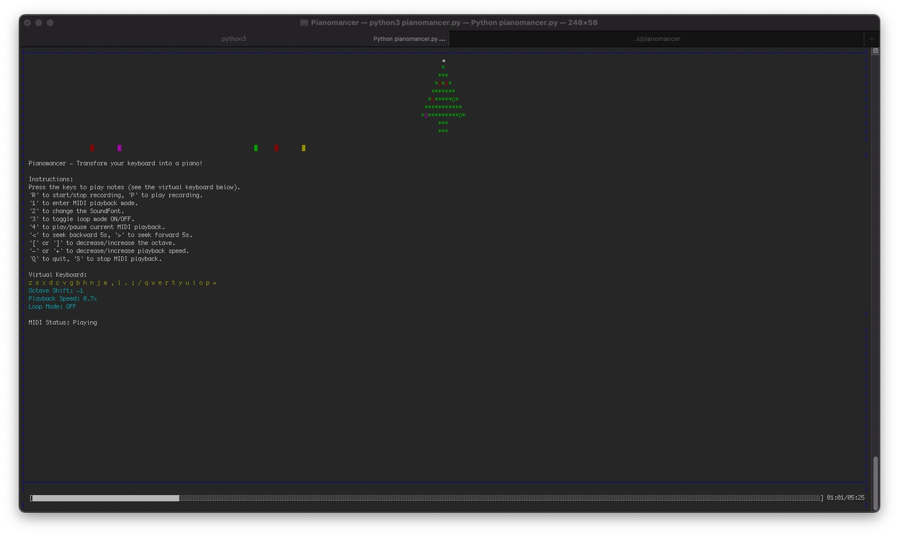

# Pianomancer 🎹✨

Transform your keyboard into a magical piano with **Pianomancer**!  
A blend of music, visuals, and interactivity, Pianomancer allows you to create melodies, load MIDI files, and enjoy a captivating dynamic visualization.

---



---

## 🌟 Features

- 🎼 **Virtual Keyboard:** Play notes using your computer keyboard.
- 🎥 **Dynamic Visualization:** A beautiful Christmas tree reacts to your music in real-time.
- 🎹 **SoundFont Support:** Customize the instrument sound by selecting your preferred `.sf2` files.
- 🚀 **Automatic SoundFont Download:** Pianomancer automatically downloads the default SoundFont (`Arachno.sf2`) if it's not present, ensuring a seamless setup.
- 🎶 **MIDI Playback:** Load and play MIDI files for an immersive experience.
- 🔴 **Record & Playback:** Record your melodies and listen to them anytime.
- 🔁 **Loop Playback Mode:** Automatically restart MIDI playback upon completion (toggle with `3` key).
- ▶️ **Play/Pause MIDI Playback:** Toggle between playing and pausing the current MIDI playback with the `4` key.
- ⏩ **Seek MIDI Playback:** Jump backward or forward in MIDI playback by pressing `<` or `>` keys.
- 🔨 **Customizable Controls:** Adjust octave (`[`/`]`), playback speed (`-`/`+`), and more, even during playback.
- 📈 **Progress Bar:** Visual progress indicator during MIDI playback.
- 🖥️ **Resizable Terminal Support:** Optimized for terminal resizing with enforced minimum dimensions for optimal display.

---

## 🚀 Installation

### Prerequisites

- **Python 3.6+**  
  Download from [python.org](https://www.python.org/downloads/).

---

### 📦 Install on Linux

1. **Install FluidSynth**  
   ```bash
   sudo apt-get update
   sudo apt-get install fluidsynth
   ```

2. **Clone the Repository**  
   ```bash
   git clone https://github.com/fabiomigueldp/pianomancer.git
   cd pianomancer
   ```

3. **Install Dependencies**  
   ```bash
   pip install -r requirements.txt
   ```

4. **Run the Application**  
   ```bash
   python pianomancer.py
   ```

---

### 🍎 Install on macOS

1. **Install Homebrew** (if not installed)  
   ```bash
   /bin/bash -c "$(curl -fsSL https://raw.githubusercontent.com/Homebrew/install/HEAD/install.sh)"
   ```

2. **Install FluidSynth**  
   ```bash
   brew install fluid-synth
   ```

3. **Clone the Repository**  
   ```bash
   git clone https://github.com/fabiomigueldp/pianomancer.git
   cd pianomancer
   ```

4. **Install Dependencies**  
   ```bash
   pip install -r requirements.txt
   ```

5. **Run the Application**  
   ```bash
   python pianomancer.py
   ```

---

### 🖥️ Install on Windows

1. **Download FluidSynth**  
   Download the latest release from [FluidSynth GitHub](https://github.com/FluidSynth/fluidsynth/releases).  
   Extract the files and add the FluidSynth executable to your system's PATH.

2. **Install `windows-curses`**  
   ```bash
   pip install windows-curses
   ```

3. **Clone the Repository**  
   ```bash
   git clone https://github.com/fabiomigueldp/pianomancer.git
   cd pianomancer
   ```

4. **Install Dependencies**  
   ```bash
   pip install -r requirements.txt
   ```

5. **Run the Application**  
   ```bash
   python pianomancer.py
   ```

---

## 🎹 How to Use

1. **Launch the Application**  
   ```bash
   python pianomancer.py
   ```

2. **Controls:**

   - 🎵 Press keys to play notes (see the virtual keyboard below).
   - 🔴 Press `R` to start/stop recording.
   - 🔊 Press `P` to playback your recording.
   - 🎼 Press `1` to load and play a MIDI file.
   - 🎨 Press `2` to change the SoundFont.
   - 🔁 Toggle Loop Playback: `3`.
   - ▶️ Play/Pause MIDI Playback: `4`.
   - ⏪ Seek Backward: `<` key (5 seconds).
   - ⏩ Seek Forward: `>` key (5 seconds).
   - 🔼 Adjust the octave: `[Decrease]` / `[Increase]`.
   - ⏬ Adjust playback speed: `-` / `+`.
   - ❌ Quit: `Q`.  
     Stop MIDI playback: `S`.

3. **Visual Feedback**  
   The Christmas tree lights up dynamically, reacting to your interactions, with active notes displayed below. During MIDI playback, a progress bar indicates the playback status, and the MIDI playback status (Playing/Paused) is displayed for better awareness.

---

## 📜 Changelog

### v1.3

- **Automatic SoundFont Download:**  
  Pianomancer now automatically downloads the default SoundFont (`Arachno.sf2`) if it's not present in the application directory, ensuring a seamless setup experience.

- **Resizable Terminal Support:**  
  Enhanced UI to handle terminal resizing with enforced minimum dimensions (80x30). Users are prompted to resize if the terminal is too small, maintaining optimal display integrity.

- **Progress Bar for MIDI Playback:**  
  Added a visual progress bar during MIDI playback, displaying the current playback position relative to the total duration, providing better feedback and control.

- **Seeking Functionality in MIDI Playback:**  
  Users can now seek backward and forward in MIDI playback by pressing `<` and `>` keys, allowing precise navigation within MIDI tracks.

- **Scrollable Selection Lists:**  
  Improved the selection interface for SoundFonts and MIDI files with scrollable and navigable lists using arrow keys and page navigation, enhancing usability when dealing with multiple files.

- **Enhanced MIDIPlayer Class:**  
  Improved the `MIDIPlayer` class to handle additional playback states, including seeking, better pause/resume functionality, and seamless integration of SoundFont changes during playback.

- **Robust Error Handling:**  
  Implemented the `SuppressStderr` context manager to prevent unwanted error messages from fluidsynth during initialization and SoundFont loading, ensuring a cleaner user experience. Enhanced in-terminal error messages guide users to resolve critical issues effectively.

- **Dynamic Visualization Improvements:**  
  Optimized the Christmas tree visualization to better handle active notes and display within resized terminals, maintaining aesthetic integrity across different terminal sizes.

- **Recording and Playback Threading:**  
  Utilized threading for playback operations to prevent blocking the main UI loop, resulting in smoother interactions and responsive controls during playback and recording.

- **Bug Fixes:**
  - Resolved various minor UI rendering issues to ensure consistent display across different terminal sizes and systems.
  - Fixed inconsistencies in playback state management to prevent unexpected behavior during pause and resume operations.

### v1.2

- **Play/Pause MIDI Playback:**  
  Press `4` to toggle between playing and pausing the current MIDI playback, offering greater control over your listening experience.

- **Dynamic SoundFont Management:**  
  Ability to change the SoundFont (`2` key) during MIDI playback. The application will automatically pause playback, allow you to select a new SoundFont, and then resume playback seamlessly.

- **Enhanced Playback Controls:**  
  Adjust octave (`[`/`]`) and playback speed (`-`/`+`) even while a MIDI file is playing, providing more flexibility in how you experience your music.

- **MIDIPlayer Class Enhancements:**  
  Improved the MIDIPlayer class to handle new playback states such as pausing, resuming, and integrating SoundFont changes without interrupting the user experience.

- **Visual Feedback Improvements:**  
  Added MIDI playback status display (Playing/Paused) to keep users informed about the current state of MIDI playback.

- **Code Refactoring and Stability:**  
  Optimized event handling and error management to ensure smoother performance and prevent conflicts between different controls.

---

## 🛠️ Development

### Contributing
Feel free to fork the repository and submit a pull request with your improvements!

---

## 📜 License

This project is licensed under the [MIT License](LICENSE).  

---

## 👤 Author

**Fábio Miguel Denda Pacheco**  
*Created on December 4, 2024*  

---

### 🌐 Connect
- Discord: [https://discord.gg/mx3aUF4C](https://discord.gg/mx3aUF4C)

---

## 🐛 Known Issues

- **SoundFont Change During Playback:**  
  When changing the SoundFont (`2` key) during an ongoing MIDI playback, the new SoundFont is not applied correctly. The SoundFont only takes effect when initiating a new playback session. This issue is under investigation and will be addressed in future updates.

---
